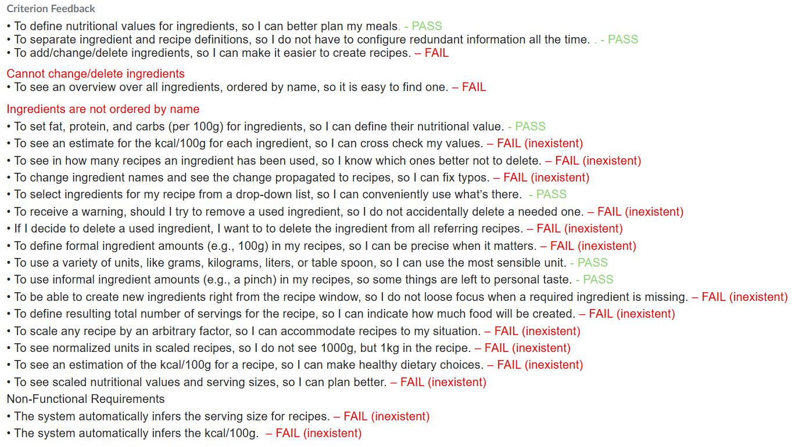
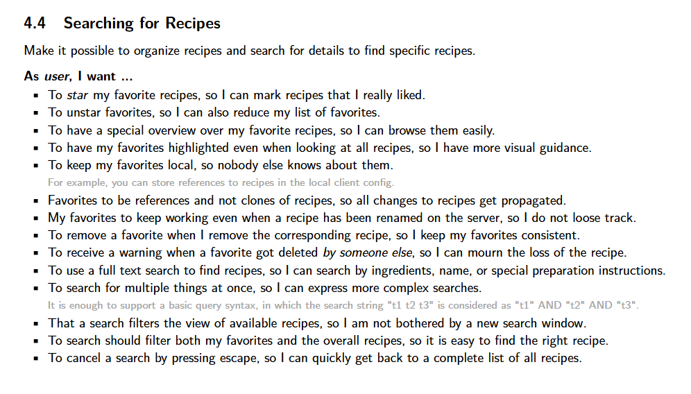

# Agenda CSEP Meeting Week 8 — Group 71

**Friday, 16 January 2026 at 14:45**
**Location:** DW PC Hall 2

| Name                   | Role             | P   | A   |
|------------------------|------------------|-----|-----|
| **Melchior Besançon**  | **Chair**        | [ ] | [ ] |
| **Luca Terrevazzi**    | **Minute Taker** | [ ] | [ ] |
| Daphne Charaki         |                  | [ ] | [ ] |
| Doğa Gürer             |                  | [ ] | [ ] |
| Karsten van den Heuvel |                  | [ ] | [ ] |
| Bo Li                  |                  | [ ] | [ ] |

---

## Agenda Items

### 1. Opening & Setup (2 minutes)

* **Opening:** Welcome.
* How is everyone doing ?
* **Agenda Overview:** Approval of today's agenda.

### 2. Updates & Progress Review (10 minutes)

* **Review of Week 7 Action Items:**
* Status of the "Basic Requirements" (Recipe creation/deletion, Ingredient overview).
* Did we finish the items listed in "Priority" last week? (e.g., Deleting recipe button, Edit button, Cloning recipe).
* Everybody explain what they did
* Luca : Favorite (does the project now run correctly for you, no more issues ?)
* Karsten worked on the ingredient fixing
* Doga did Recipe Editing
* Melchior : Recipe searching and fixing refresh and Add button + fix download
* Bo : Delete and Edit Recipe buttons
* Daphne : Worked on the server and wesockets
* Any questions ? Did it go well ? Do you want to add something about what you did ?

### 3. TA Feedback & Demo (5 minutes)

* **Demo to TA:**
* Demonstrate the current "Potentially Shippable Product".
* She can play around and try to break it
* Show that the basic requirements are now there.

* **Questions for TA:**
* Any specific clarifications needed on the backlog?
* Announcements of the TA

### 4. Tasks & Planning for the final week (10 minutes)

* This is the last week that we can code. The final rush!
* **Backlog & Remaining Features:**
* Check progress against "Basic Requirements" (Backlog 4.1).
* Use the grades in Brightspace/Assignments/"Feedback for Implemented Features (Formative)" to see what is missing.

* Status of "Nutritional Value" (Backlog 4.3) and "search recipe" (Backlog 4.4) features.

* Deadline (freeze code) on Friday, so should we say no more features implementations starting from Thursday ?
Then we can verify that it works and have an early final version... We can use friday to debug maybe

### 5. Task Distribution for Next Week (5 minutes)

* Where do we have to put our focus ?
* If basic requirements are meet -> distribute nutritional values
* 

### 6. If we have extra time / if we need more to distribute

* We can have a look at other features, like searching for Recipes:

* Does someone have to add something ?

### 6. Closing (3 minutes)

* **Recap:** Summary of decisions and action items.
* **Next Meeting:** Confirm time and roles for the next TA-less meeting.
* **Questions:** Any final questions or announcements?

Official closure 🔨

